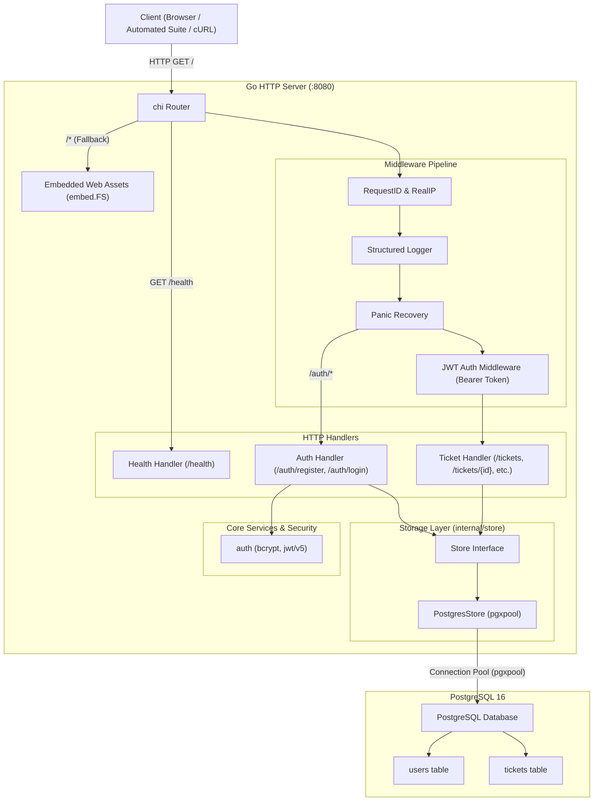
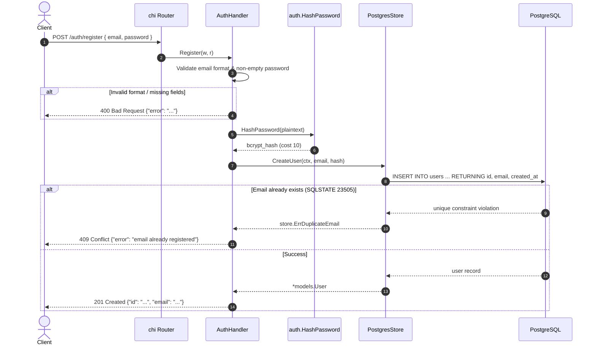
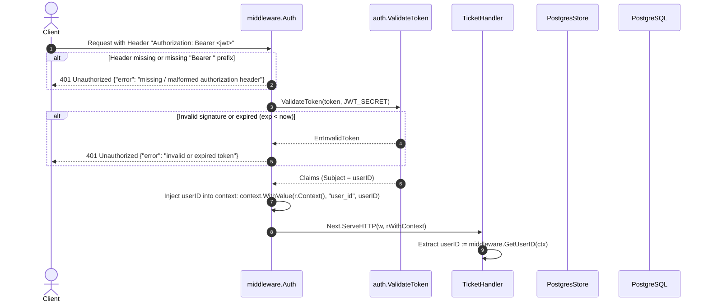
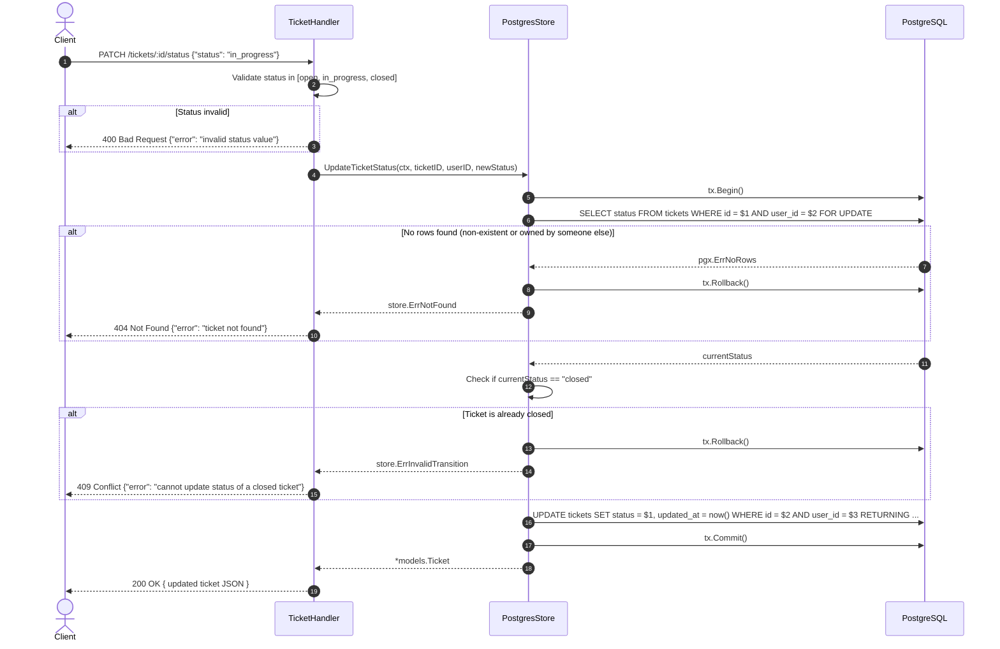
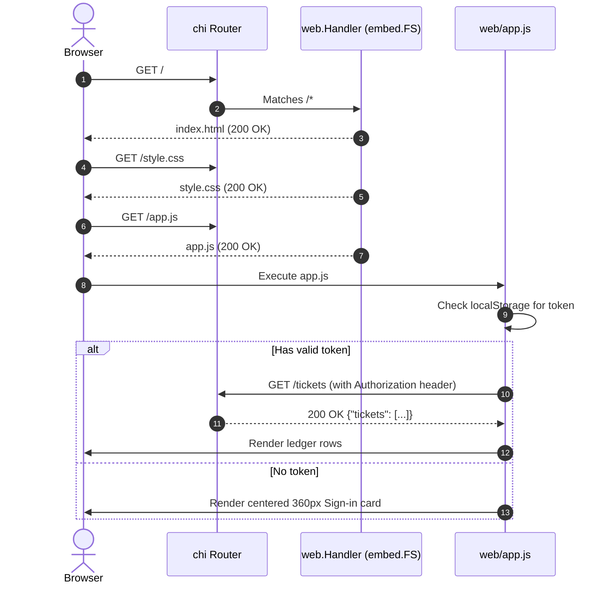

# Ticket System — Architecture & Design Document

A comprehensive technical breakdown of the architecture, design decisions, database schemas, and request lifecycles for the Ticket Management System.

---

## 1. System Overview & Core Objectives

The Ticket System is a production-grade, multi-tenant ticketing service built with Go, PostgreSQL, and modern browser standards. It serves both as a strictly-contracted REST API and a minimalist "personal ledger" web application.

### Key Architectural Principles:
1. **Query-Level Data Isolation**: Users may only access and modify tickets they own. Ownership checks are strictly enforced in SQL `WHERE` clauses, never deferred to application-level post-filtering.
2. **Deterministic State Machine**: Ticket status follows a strict lifecycle (`open`, `in_progress`, `closed`). Closed tickets are terminal and permanently immutable.
3. **Defense in Depth**: Password hashes are never logged or serialized in JSON responses (`json:"-"`). Non-existent tickets and foreign tickets return identical `404 Not Found` statuses to prevent ID probing.
4. **Self-Contained Deployment**: The single compiled Go binary embeds both SQL schema migrations and frontend assets, requiring zero external assets or npm build pipelines at runtime.

---

## 2. High-Level Architecture

The system follows a standard layered architecture with explicit boundaries between HTTP routing, business logic/middleware, and data persistence:



---

## 3. Key Design Choices & Rationale

### 3.1 Routing: `go-chi/chi/v5`
- **Why Chi?** Lightweight, 100% compliant with Go's standard `net/http` handlers and contexts, with zero allocation routing.
- **Parametric Routing**: Enables URL parameter matching (`/tickets/{id}`, `/tickets/{id}/status`) without third-party regex overhead.
- **Middleware Subrouters**: Allows grouping protected endpoints under `r.Group()` without applying the JWT authentication middleware to public endpoints (`/health`, `/auth/*`, `/`).

### 3.2 Database Access: `jackc/pgx/v5` with `pgxpool`
- **Why pgx instead of `database/sql` + `lib/pq`?** `lib/pq` is officially in maintenance mode. `pgx` is the high-performance standard for PostgreSQL in Go, featuring native PostgreSQL type support, binary protocol encoding, and robust connection pooling (`pgxpool.Pool`).
- **Connection Management**: Configured with `MaxConns = 25`, `MinConns = 2`, `MaxConnLifetime = 1h`, and `MaxConnIdleTime = 15m`.

### 3.3 Strict Hard-Coded Port (`:8080`)
- **Requirement**: The assignment specification strictly mandates that the service must bind to `:8080` without reading environment variables.
- **Implementation**: Hard-coded in `cmd/server/main.go` as `http.Server{ Addr: ":8080" }`. In `docker-compose.yml`, the host port mapping is exposed via `"${APP_PORT:-8080}:8080"` so that local host port conflicts (e.g. port 8080 occupied on host) can be mapped without violating the container's internal `:8080` requirement.

### 3.4 Embedded Migrations & Web Assets (`//go:embed`)
- **Zero-Dependency Artifacts**: `migrations/001_init.sql` and `web/*` (HTML, CSS, JS) are compiled directly into the Go binary.
- **Reliability**: Eliminates runtime filesystem lookup failures when moving binaries across container stages or cloud hosts. Migrations execute idempotently on startup.

### 3.5 Status Transition State Machine & Concurrency Control
- **Rules**:
  - `open` → `in_progress` (Allowed)
  - `in_progress` → `closed` (Allowed)
  - `open` → `closed` (Allowed per Assignment Change Request)
  - Modifying an already-`closed` ticket → Rejected with `409 Conflict`.
  - Unrecognized status string → Rejected with `400 Bad Request`.
- **Pessimistic Concurrency Locking**: In `UpdateTicketStatus`, execution begins inside a PostgreSQL transaction (`tx.Begin`). The ticket is retrieved using:
  ```sql
  SELECT status FROM tickets WHERE id = $1 AND user_id = $2 FOR UPDATE
  ```
  `FOR UPDATE` acquires an exclusive row-level lock. This eliminates race conditions where concurrent PATCH requests could attempt conflicting state transitions simultaneously.

### 3.6 Query-Level Ownership Enforcement (ID Enumeration Defense)
- **Security Flaw Avoided**: In naive systems, code fetches an entity by ID (`WHERE id = $1`) and then checks `if ticket.UserID != callerID { return 403 Forbidden }`. This leaks information by confirming that a resource ID exists.
- **Our Approach**:
  ```sql
  SELECT id, user_id, title, description, status, created_at, updated_at
  FROM tickets
  WHERE id = $1 AND user_id = $2
  ```
  If no row matches, `pgx.ErrNoRows` is mapped to `store.ErrNotFound`, and the API returns `404 Not Found` with `{"error": "ticket not found"}`. Attackers cannot differentiate between a non-existent ticket and another user's private ticket.

---

## 4. Data Model & Database Schema

The database uses PostgreSQL UUIDs generated via `gen_random_uuid()`.

### 4.1 `users` Table
```sql
CREATE TABLE IF NOT EXISTS users (
    id UUID PRIMARY KEY DEFAULT gen_random_uuid(),
    email TEXT UNIQUE NOT NULL,
    password_hash TEXT NOT NULL,
    created_at TIMESTAMPTZ NOT NULL DEFAULT now()
);
```
- `email`: Enforced unique at database level. Constraint violation error code `23505` is caught and translated to `409 Conflict`.
- `password_hash`: Bcrypt hash (cost 10). Omitted from all JSON serialization via `json:"-"` tag in struct.

### 4.2 `tickets` Table
```sql
CREATE TABLE IF NOT EXISTS tickets (
    id UUID PRIMARY KEY DEFAULT gen_random_uuid(),
    user_id UUID NOT NULL REFERENCES users(id) ON DELETE CASCADE,
    title TEXT NOT NULL,
    description TEXT,
    status TEXT NOT NULL DEFAULT 'open' CHECK (status IN ('open', 'in_progress', 'closed')),
    created_at TIMESTAMPTZ NOT NULL DEFAULT now(),
    updated_at TIMESTAMPTZ NOT NULL DEFAULT now()
);

CREATE INDEX IF NOT EXISTS idx_tickets_user_id ON tickets(user_id);
```
- `user_id`: Foreign key linked to `users(id)` with cascade deletion.
- `status`: Check constraint ensuring only valid enum strings exist in the database.
- `idx_tickets_user_id`: B-Tree index optimizing user-scoped queries (`WHERE user_id = $1`).

---

## 5. End-to-End Request Lifecycles

### 5.1 Registration Request (`POST /auth/register`)



---

### 5.2 Authenticated Request Flow & Middleware Injection



---

### 5.3 Ticket Status Transition Flow (`PATCH /tickets/{id}/status`)



---

### 5.4 Web UI Serving Flow (`GET /` and Assets)



---

## 6. Security Architecture & Threat Mitigation

| Threat / Vulnerability | Mitigation Strategy | Location in Code |
|---|---|---|
| **SQL Injection** | Strict use of parameterized prepared queries (`$1, $2`). No dynamic string concatenation in SQL queries. | [`internal/store/postgres.go`](file:///home/uttam/dev/ticket-booking-system/internal/store/postgres.go) |
| **Password Leakage** | Bcrypt hashing with cost 10 before storage; `password_hash` annotated with `json:"-"` to prevent accidental serialization; passwords omitted from server logs. | [`internal/models/user.go`](file:///home/uttam/dev/ticket-booking-system/internal/models/user.go)<br>[`internal/auth/auth.go`](file:///home/uttam/dev/ticket-booking-system/internal/auth/auth.go) |
| **Credential Probing / Enumeration** | Login returns identical generic message (`"invalid email or password"`) for both unknown emails and incorrect passwords. | [`internal/handlers/auth.go`](file:///home/uttam/dev/ticket-booking-system/internal/handlers/auth.go#L95-L105) |
| **ID Probing / Insecure Direct Object Reference (IDOR)** | Queries filter by `user_id = $2`. Foreign ticket access returns `404 Not Found` rather than `403 Forbidden`. | [`internal/store/postgres.go`](file:///home/uttam/dev/ticket-booking-system/internal/store/postgres.go#L160-L180) |
| **Race Conditions in State Updates** | Pessimistic locking via `SELECT ... FOR UPDATE` inside a database transaction ensures serial status validation. | [`internal/store/postgres.go`](file:///home/uttam/dev/ticket-booking-system/internal/store/postgres.go#L182-L245) |
| **Token Forgery & Tampering** | HMAC-SHA256 (`HS256`) cryptographic signature verification against server secret `JWT_SECRET`; expired token checks (`exp`). | [`internal/auth/auth.go`](file:///home/uttam/dev/ticket-booking-system/internal/auth/auth.go#L50-L75) |

---

## 7. Standardized Error Response Format

All failure modes return a consistent JSON schema:
```json
{
  "error": "human readable error message"
}
```

HTTP status codes strictly communicate failure categories:
- `400 Bad Request`: Schema validation failures (empty title, invalid email, malformed JSON).
- `401 Unauthorized`: Missing, expired, or invalid JWT; wrong login credentials.
- `404 Not Found`: Non-existent ticket or ticket owned by another user.
- `409 Conflict`: Duplicate email on registration; modifying a closed ticket.
- `500 Internal Server Error`: Unhandled database connection failures or internal faults (logged server-side, masked from client).

---

## 8. Directory Layout & Module Responsibilities

```
.
├── cmd/
│   └── server/
│       └── main.go          # Application entrypoint: loads env, initializes DB, mounts routes, starts server (:8080)
├── internal/
│   ├── auth/                # Cryptographic utilities: bcrypt password hashing and JWT issuance/validation
│   │   ├── auth.go
│   │   └── auth_test.go
│   ├── db/                  # PostgreSQL pool initialization (pgxpool) and automated schema migration runner
│   │   └── db.go
│   ├── handlers/            # HTTP request controllers: request parsing, DTO validation, JSON response formatting
│   │   ├── auth.go
│   │   ├── health.go
│   │   ├── response.go
│   │   ├── tickets.go
│   │   └── handlers_test.go
│   ├── middleware/          # HTTP middleware: JWT extraction, validation, and user_id context injection
│   │   ├── auth.go
│   │   └── auth_test.go
│   ├── models/              # Domain structs and JSON Data Transfer Objects (User, Ticket, Request/Response payloads)
│   │   ├── ticket.go
│   │   └── user.go
│   └── store/               # Persistence layer: SQL queries, transaction management, query-level ownership isolation
│       ├── postgres.go
│       ├── postgres_test.go
│       └── store.go
├── migrations/              # SQL schema migration scripts and embed wrapper
│   ├── 001_init.sql
│   └── migrations.go
├── web/                     # Self-contained personal ledger frontend (HTML, CSS, JS) embedded via go:embed
│   ├── app.js
│   ├── index.html
│   ├── style.css
│   └── web.go
├── Dockerfile               # Multi-stage production container build (Alpine runtime, 20.7 MB)
├── docker-compose.yml       # Local development stack (App + PostgreSQL with healthchecks)
├── fly.toml                 # Deployment specification for Fly.io
├── README.md                # Project documentation and quickstart instructions
├── SPEC.md                  # Backend API specification & grading contract
├── UI-SPEC.md               # Frontend ledger UI design specification
└── ARCHITECTURE.md          # Architecture, design choices, and request flow documentation
```
